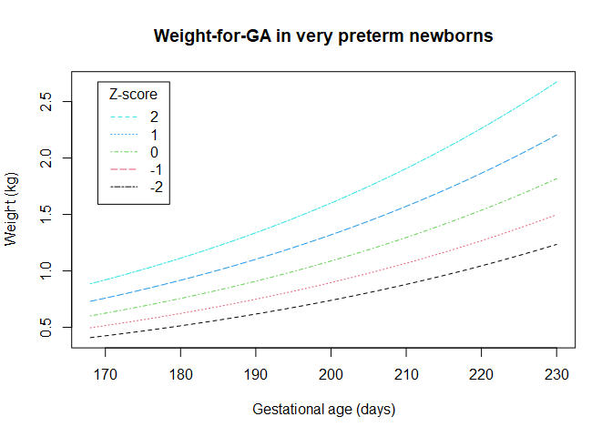

<!-- README.md is generated from README.Rmd. Please edit that file -->

# gigs 

<!-- badges: start -->

[](https://github.com/lshtm-gigs/gigs/actions/workflows/R-CMD-check.yaml)
[](https://www.repostatus.org/#active)
[](https://www.r-pkg.org/pkg/gigs)
[](https://github.com/lshtm-gigs/gigs/actions/workflows/test-coverage.yaml)
[](https://codecov.io/github/lshtm-gigs/gigs)
<!-- badges: end -->

## Overview

Produced as part of the Guidance for International Growth Standards
project, gigs provides a single, simple interface for working with the
WHO Child Growth Standards and outputs from the
INTERGROWTH-21<sup>st</sup> project. You will find functions for
converting from anthropometric measures (e.g. weight or length) to
z-scores and percentiles, and the inverse. Also included are functions
for classifying newborn and infant growth according to literature-based
cut-offs.

## Installation

``` r
# You can install the development version from GitHub with `remotes`:
# install.packages("remotes")
remotes::install_github(repo = "lshtm-gigs/gigs")
```

## Available standards

- `ig_nbs` - INTERGROWTH-21<sup>st</sup> Newborn Size standards
  (including very preterm)
  <details>
  <summary>
  Component standards
  </summary>

  | Acronym  | Description                                | Unit  | `gest_age` range |
  |----------|--------------------------------------------|-------|------------------|
  | `wfga`   | Weight-or-gestational age                  | kg    | 168 to 300 days  |
  | `lfga`   | Length-for-gestational age                 | cm    | 168 to 300 days  |
  | `hcfga`  | Head circumference-for-gestational age     | cm    | 168 to 300 days  |
  | `wlrfga` | Weight-to-length ratio-for-gestational age | kg/cm | 168 to 300 days  |
  | `ffmfga` | Fat-free mass-for-gestational age          | kg    | 266 to 294 days  |
  | `bfpfga` | Body fat percentage-for-gestational age    | %     | 266 to 294 days  |
  | `fmfga`  | Fat mass-for-gestational age               | kg    | 266 to 294 days  |

  </details>
- `ig_png` - INTERGROWTH-21<sup>st</sup> Postnatal Growth of Preterm
  Infants standards
  <details>
  <summary>
  Component standards
  </summary>

  | Acronym | Description                | Unit | `x` range              |
  |---------|----------------------------|------|------------------------|
  | `wfa`   | weight-for-age             | kg   | 27 to \<64 exact weeks |
  | `lfa`   | length-for-age             | cm   | 27 to \<64 exact weeks |
  | `hcfa`  | head circumference-for-age | cm   | 27 to \<64 exact weeks |
  | `wfl`   | weight-for-length          | kg   | 35 to 65 cm            |

  </details>
- `who_gs` - WHO Child Growth Standards for term infants
  <details>
  <summary>
  Component standards
  </summary>

  | Acronym | Description                  | Unit             | `x` range       |
  |---------|------------------------------|------------------|-----------------|
  | `wfa`   | weight-for-age               | kg               | 0 to 1856 days  |
  | `bfa`   | BMI-for-age                  | kg/m<sup>2</sup> | 0 to 1856 days  |
  | `lhfa`  | length/height-for-age        | cm               | 0 to 1856 days  |
  | `hcfa`  | head circumference-for-age   | cm               | 0 to 1856 days  |
  | `wfl`   | weight-for-height            | kg               | 45 to 110 cm    |
  | `wfh`   | weight-for-length            | kg               | 65 to 120 cm    |
  | `acfa`  | arm circumference-for-age    | cm               | 91 to 1856 days |
  | `ssfa`  | subscapular skinfold-for-age | mm               | 91 to 1856 days |
  | `tsfa`  | triceps skinfold-for-age     | mm               | 91 to 1856 days |

  </details>

## Conversion functions

Conversion functions are named according to the set of standards in use,
the component standard from that set, then the type of conversion. For
example, to convert *values to z-scores* in the *weight-for-GA* standard
from the *INTERGROWTH-21<sup>st</sup> Newborn Size Standards* would be:
`ig_nbs`/`_wfga`/`_value2zscore()`

Similarly, the conversion of length-for-age values to percentiles in
term and preterm infants could be performed with the WHO Child Growth
Standards and INTERGROWTH-21<sup>st</sup> Postnatal Growth of Preterm
Infants Standards, respectively:

- Term infants: `who_gs`/`_lhfa`/`_value2zscore()`
- Preterm infants: `ig_png`/`_lfa`/`_value2percentile()`

If the component standard is not included in the function call, it
should be passed to the `acronym` parameter of the general function
call. For example, these two function calls would behave in the same
way:

``` r
ig_nbs_value2zscore(y = 25.7, gest_days = 182, sex = "F", acronym = "hcfga") |>
  round(digits = 2)
#> [1] 1.18

ig_nbs_hcfga_value2zscore(headcirc_cm = 25.7, gest_days = 182, sex = "F") |>
  round(digits = 2)
#> [1] 1.18
```

A vector of `acronym` values can be used if you want to convert with
different standards for each input.

### Values to z-scores/percentiles

These functions allow easy conversion from measured values to z-scores
or percentiles for the standard used.

``` r
# Convert from z-scores for individual values...
ig_nbs_value2zscore(y = 0.785, gest_days = 182, sex = "F", acronym = "wfga") |>
  round(digits = 2)
#> [1] 0

# .. or for multiple inputs
ig_nbs_wfga_value2percentile(weight_kg = 0.785,
                             gest_days = seq(175, 196, by = 7),
                             sex = "F") |>
  round(digits = 2)
#> [1] 0.75 0.50 0.25 0.09

# You can do the same for percentiles
ig_png_wfa_value2percentile(weight_kg = c(2.86, 3.12, 3.12, 3.43, 3.77, 4.10),
                            pma_weeks = 40,
                            sex = "M") |>
  round(digits = 2)
#> [1] 0.10 0.25 0.25 0.50 0.75 0.90
```

### Z-scores/percentiles to values

These functions convert z-scores to expected anthropometric
measurements. They are mostly useful for the creation of reference
curves (see below).

``` r
# Convert from z-scores for individual values...
ig_nbs_zscore2value(z = 0, gest_days = 182, sex = "F", acronym = "wfga") |>
  round(digits = 3)
#> [1] 0.785

# .. or for multiple inputs
ig_nbs_wfga_zscore2value(z = 0, gest_days = seq(182, 204, by = 7), sex = "F") |>
  round(digits = 3)
#> [1] 0.785 0.893 1.013 1.147

# You can do the same for percentiles
ig_png_wfa_percentile2value(p = c(0.1, 0.25, 0.5, 0.75, 0.9),
                            pma_weeks = 40,
                            sex = "M") |>
  round(digits = 2)
#> [1] 2.87 3.12 3.43 3.77 4.11
```

#### Reference curves

We can use gigs to generate reference curves for the standards by
getting curves for the expected weight at multiple z-scores across
multiple gestational ages. We would usually recommend
[`ggplot2`](https://ggplot2.tidyverse.org/) for such visualisation, but
do not use it here to reduce our package’s dependencies.

``` r
z_score_range <- -2:2
gestage_range <- 168:230
ref <- mapply(z_score_range,
               FUN = function(z) {
                 gigs::ig_nbs_wfga_zscore2value(z = z,
                                                gest_days = gestage_range,
                                                sex = "F")
               })
matplot(ref, x = gestage_range, col = 1:5, type = "l", lty = 2:6,
        xlab = "Gestational age (days)",
        ylab = "Weight (kg)")
title(main = "Weight-for-GA in very preterm newborns")
legend(x = min(gestage_range) + 1, y = ref[length(ref)], legend = 2:-2,
       title = "Z-score", col = 5:1, lty = 2:6)
```



## Classification functions

These functions allow for quick identification of at-risk infants
through classification of suboptimal growth. The cut-offs used are
sourced from research literature; you can check the function
documentation to see these sources.

``` r
# Size for gestational age
classify_sga(
  weight_kg = c(2.1, 3.2, 4.5),
  gest_days = c(252, 259, 290),
  sex = "M"
)
#> [1] SGA AGA LGA
#> Levels: SGA AGA LGA

# Small vulnerable newborns
classify_svn(
  weight_kg = c(2.1, 3.2, 4.5),
  gest_days = c(252, 259, 290),
  sex = "M"
)
#> [1] Preterm SGA Term AGA    Term LGA   
#> Levels: Preterm SGA Preterm AGA Preterm LGA Term SGA Term AGA Term LGA

# Stunting, i.e. low length increase relative to age
classify_stunting(
  lenht_cm = c(42.3, 75.4, 72.83),
  age_days = c(252, 525, 245),
  gest_days = c(238, 259, 266),
  sex = "M"
)
#> [1] stunting_severe stunting        normal         
#> Levels: stunting_severe stunting normal

# Wasting, i.e. low weight increase relative to length/height
classify_wasting(
  weight_kg = c(5.75, 2.18, 5.30, 6.75),
  lenht_cm = c(67.7, 46.6, 55.8, 80.1),
  gest_days = c(268, 247, 250, 278),
  age_days = c(45, 33, 230, 278),
  sex = c("F", "M", "F", "M"),
)
#> [1] wasting_severe wasting        normal         wasting_severe
#> Levels: wasting_severe wasting normal overweight

# Weight-for-age, i.e. low weight increase relative to age
classify_wfa(
  weight_kg = c(2.1, 7.2, 6.1, 9.1, 9.4),
  age_days = c(435, 501, 323, 201, 154),
  gest_days = c(36, 27, 37, 40, 28),
  sex = c("M", "M", "F", "F", "F")
)
#> [1] underweight_severe underweight_severe <NA>               <NA>              
#> [5] overweight        
#> Levels: underweight_severe underweight normal overweight
```
