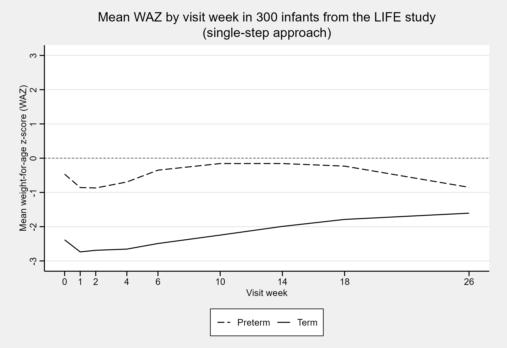
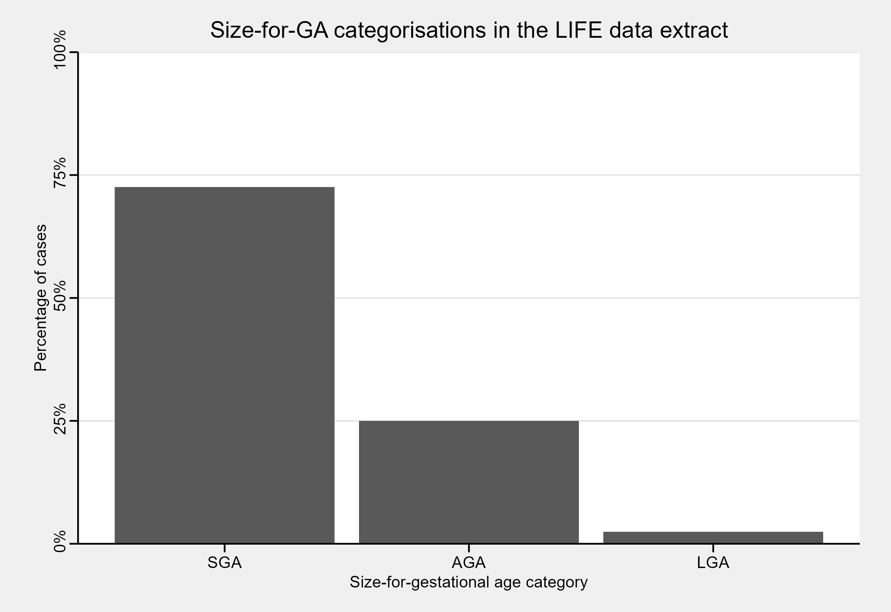

```{r knitr_opts, include = FALSE}
knitr::opts_chunk$set(collapse = TRUE, comment = "#>")
intergrowth21st <- if (knitr::is_html_output()) {
  "INTERGROWTH-21<sup>st</sup>"
} else {
  "INTERGROWTH-21\textsuperscript{st}"
}
```

# Introduction

gigs is a package designed to make the implementation of the international
growth standards from the `r intergrowth21st` project and World Health
Organisation Child Growth Standards as easy as possible. It provides
functions for easy and reproducible classification of fetal, newborn, and infant
growth using international growth standards. The package allows conversions and
classifications of growth measurements to centiles, z-scores, and common
international metrics such as stunting.

## Getting started

Let's start by loading the package. We're also turning off the warnings which
gigs prints if inputs are `NA`, `NaN`, or similarly invalid, as to avoid
cluttering the console output.

```{r setup}
library(gigs)
gigs_options_set(new_value = "quiet")
```

This vignette has two examples for applying gigs. The first is using gigs to
convert growth measurements into centiles or z-scores according to appropriate
standards from either the `r intergrowth21st` or WHO Child Growth standards. The
second is using gigs to convert growth measurements to categorical growth
outcomes, in this case size-for-gestational age.

## Example data
This tutorial uses a sample of data from 300 infants enrolled in the Low
birthweight Infant Feeding Exploration (LIFE) study [@Vesel2022LowSettings;
@Vesel2023FeedingStudy]. These infants were assessed at birth then followed up
at intervals after birth, with data available up to six months of age in this
data extract.

Though `gigs::life6mo` has data on length in cm (`len_cm`), head circumference
(`headcirc_cm`), and mid-upper arm circumference (`muac_cm`), we are going to
subset this dataset to focus on weight in kilograms (`wt_kg`). The dataset
also has columns with an ID number per infant in the study (`id`), the
gestational age at birth for each infant (`gestage`), the sex of each infant
(`sex`; `"M"` = male, `"F"` = female), the visit week at which weight was
recorded (`visitweek`), and post-menstrual age in days (`pma`).

After loading the dataset, we add a variable `preterm`, which is `TRUE` wherever
an infant was born before 37 weeks' gestational age. We also convert `sex` from
a `factor` to a `character` variable so that `gigs` will accept it as an input.

### Loading the data
```{r load_data}
data(life6mo)
life6mo <- life6mo[, 1:7] # Removes `len_cm`, `headcirc_cm`, and `muac_cm`
life6mo$preterm <- life6mo$gestage < 37 * 7
life6mo$sex <- as.character(life6mo$sex)
life6mo$id <- as.factor(life6mo$id)
head(life6mo, n = 5)
```

# Using gigs to convert growth measurements to z-scores

## Single-step approach
The easiest way to use gigs is to let it handle work for you. Using its growth
classification functions, you can apply GIGS-recommended growth standards for
each measurement and time point in a dataset. Standards are applied based on the
best practices advised by WHO and `r intergrowth21st` when using their
respective growth standards.

We can use `classify_wfa()` to add weight-for-age z-scores to our dataset in a
single step. This function works like `dplyr::mutate()` and other
[data-masking](https://rlang.r-lib.org/reference/args_data_masking.html)
functions: you refer to columns in `.data` using the raw column names:

```{r simple_gen_WAZs}
life6mo_zscored <- classify_wfa(.data = life6mo,
                                weight_kg = wt_kg,
                                age_days = age_days,
                                gest_days = gestage,
                                sex = sex,
                                id = id)
life6mo_zscored[, c("id", "visitweek", "gestage", "age_days", "sex", "waz")] |>
  head(n = 5)
```

On plotting the mean weight-for-age z-scores as a function of the visit week, we
see that preterm z-scores in the LIFE data extract are on average higher than
for term infants. This is expected for this dataset, as term infants in the
LIFE study were only included if they were particularly small at birth. In
contrast, preterm infants were included irrespective of their relative size at
birth.

```{r waz_simple_ggplot, echo = FALSE, eval = FALSE}
# Eval locally with ggplot2; use next code block to display image
ggplot_waz_simple <- life6mo_zscored |>
  dplyr::summarise(meanWAZ = mean(waz, na.rm = TRUE),
                   .by = c(visitweek, preterm)) |>
  dplyr::mutate(`Term Status` = ifelse(preterm, "Preterm", "Term")) |>
  ggplot2::ggplot(ggplot2::aes(x = visitweek, y = meanWAZ, linetype = `Term Status`)) +
  ggplot2::geom_line() +
  ggplot2::geom_hline(ggplot2::aes(yintercept = 0), linewidth = 0.25, linetype = "dashed") +
  ggplot2::scale_x_continuous(breaks = unique(life6mo$visitweek)) +
  ggplot2::scale_y_continuous(limits = c(-3, 3), breaks = -3:3) +
  ggplot2::scale_linetype_manual(values = c(Preterm = "longdash", Term = "solid")) +
  ggplot2::labs(title = "Mean WAZ by visit week in 300 infants from the LIFE study\n(single-step approach)",
                x = "Visit week",
                y = "Mean weight-for-age z-score (WAZ)") +
  ggthemes::theme_stata(scheme = "sj") +
  ggplot2::theme(legend.title = ggplot2::element_blank(),
                 axis.text.y = ggplot2::element_text(angle = 90, hjust = 0.55, vjust = 0.5))

ggplot_waz_simple |>
  ggplot2::ggsave(filename = "vignettes/gigs_waz_simple.png",
                  type = "cairo",
                  width = 7.62, height = 5.24, units = "in",
                  dpi = 300)
```

```{r waz_simple_include, fig.align = "center", out.width="95%", echo = FALSE, alt.text = "A line graph showing mean WAZ by visit week in 300 infants from the LIFE study. There is a line for preterm infants (dotted) and term infants (solid). Term infants in this study were consistently smaller than the preterm participants."}

```

## Multi-step approach
Instead of letting GIGS do the heavy lifting, you may want to clearly lay out
the steps taken in your analysis. Luckily, gigs provides all the functionality
you need for this.

We start by generating WAZs using each growth standard. To do this, we need to
use the gigs conversion functions. These take vectors of growth data and convert
them into z-scores or centiles. You can use either `value2zscore()` or
`value2zcentile()` depending on which conversion you want to do. You then pass
in two parameters, `family` and `acronym`, which describe:

- `family`: The broad set of growth standards you want to use
   * `ig_fet` - `r intergrowth21st` Fetal standards [@Papageorghiou2014AInternationalPregnancy; @Stirnemann2017InternationalProject; @Papageorghiou2016InternationalCountries; @Papageorghiou2014BInternationalPregnancy; @Drukker2020InternationalProject; @Rodriguez-Sibaja2021FetalProject; @Stirnemann2020IntergrowthWeight]
   * `ig_nbs` - `r intergrowth21st` Newborn Size Standards (incl. very preterm) [@Villar2014InternationalProject; @Villar2016INTERGROWTH-21stCharts; @Villar2017BodyProject]
   * `ig_png` - `r intergrowth21st` Postnatal Growth Standards [@Villar2015PostnatalProject]
   * `who_gs` - WHO Child Growth Standards [@WHOMulticentreGrowthReferenceStudyGroup2006WHOAge; @WHO2006WHODevelopment; @WHO2007WHODevelopment]

- `acronym`: The specific growth standard you want to use, e.g. for the
  `r intergrowth21st` Postnatal Growth Standards:
   *  `"wfa"` (weight-for-age)
   *  `"lfa"` (length-for-age)
   *  `"hcfa"` (head circumference-for-age)
   *  `"wfl"` (weight-for-length)

```{r complex_gen_WAZs}
waz_nbs <- with(life6mo, value2zscore(y = wt_kg,
                                      x = gestage,
                                      sex = sex,
                                      family = "ig_nbs",
                                      acronym = "wfga"))
waz_who <- with(life6mo, value2zscore(y =  wt_kg,
                                      x = age_days,
                                      sex = sex,
                                      family = "who_gs",
                                      acronym = "wfa"))
waz_png <- with(life6mo, value2zscore(y =  wt_kg,
                                      x = pma / 7,
                                      sex = sex,
                                      family = "ig_png",
                                      acronym = "wfa"))
```

This "out of bounds" warning from GIGS tells us that for 128 observations GIGS
couldn't calculate a z-score, because the post-menstrual age for those
observations was outside the range of the `r intergrowth21st` Postnatal Growth
Standards (i.e. 27 to 64 weeks' post-menstrual age).

Nonetheless, we now have standard-specific WAZs. We can use a chain of
`ifelse()` functions to make one overall `waz` column in `life6mo`. The first
condition, `visitweek == 0`, ensures that the `r intergrowth21st` Newborn Size
standards are used for measures taken at visit week zero (which for this study,
is equivalent to at-birth). The `preterm` and `pma <= 64 * 7` conditions ensure
that the `r intergrowth21st` Postnatal Growth standards are used for preterm
infants who are younger than than 64 weeks PMA (the upper limit of the
`r intergrowth21st` Postnatal Growth standards). The final condition,
`use_who_gs`, ensures that the WHO Child Growth standard z-scores are used
wherever infants were either born term, or were born preterm and are older than
64 weeks PMA.

```{r complex_make_WAZ}
is_birth_measure <- with(life6mo_zscored, visitweek == 0)
use_ig_nbs <- with(life6mo_zscored, is_birth_measure)
use_ig_png <- with(life6mo_zscored,
                   !is_birth_measure & preterm & pma <= 64 * 7)
use_who_gs <- with(life6mo_zscored,
                   !is_birth_measure & !preterm | (preterm & pma > 64 * 7))
life6mo_zscored$waz_complex <- rep.int(NA_real_, nrow(life6mo_zscored))
life6mo_zscored$waz_complex[use_ig_nbs] <- waz_nbs[use_ig_nbs]
life6mo_zscored$waz_complex[use_ig_png] <- waz_png[use_ig_png]
life6mo_zscored$waz_complex[use_who_gs] <- waz_who[use_who_gs]
```

On plotting the mean WAZ for each visit week, we get the same plot as when we
used the z-scores from `classify_wfa()`!

```{r waz_complex_ggplot, echo = FALSE, eval = FALSE}
# Eval locally with ggplot2; use next code block to display image
ggplot_waz_complex <- life6mo_zscored |>
  dplyr::summarise(meanWAZ = mean(waz, na.rm = TRUE),
                   .by = c(visitweek, preterm)) |>
  dplyr::mutate(`Term Status` = ifelse(preterm, "Preterm", "Term")) |>
  ggplot2::ggplot(ggplot2::aes(x = visitweek, y = meanWAZ, linetype = `Term Status`)) +
  ggplot2::geom_line() +
  ggplot2::geom_hline(ggplot2::aes(yintercept = 0), linewidth = 0.25, linetype = "dashed") +
  ggplot2::scale_x_continuous(breaks = unique(life6mo$visitweek)) +
  ggplot2::scale_y_continuous(limits = c(-3, 3), breaks = -3:3) +
  ggplot2::scale_linetype_manual(values = c(Preterm = "longdash", Term = "solid")) +
  ggplot2::labs(title = "Mean WAZ by visit week in 300 infants from the LIFE study\n(multi-step approach)",
                x = "Visit week",
                y = "Mean weight-for-age z-score (WAZ)") +
  ggthemes::theme_stata(scheme = "sj") +
  ggplot2::theme(legend.title = ggplot2::element_blank(),
                 axis.text.y = ggplot2::element_text(angle = 90, hjust = 0.55, vjust = 0.5))

ggplot_waz_complex |>
  ggplot2::ggsave(filename = "vignettes/gigs_waz_complex.png",
                  type = "cairo",
                  width = 7.62, height = 5.24, units = "in",
                  dpi = 300)
```

```{r waz_complex_include, fig.align = "center", out.width="95%", echo = FALSE, alt.text = "A line graph showing mean WAZ by visit week in 300 infants from the LIFE study. There is a line for preterm infants (dotted) and term infants (solid). Term infants in this study were consistently smaller than the preterm participants."}
knitr::include_graphics("gigs_waz_complex.png")
```

Sure - you *can* do it yourself, but doing it manually is likelier to have you
applying the wrong standards at each time point. Instead, use the
`classify_growth()` function and friends to automatically apply the best
growth standards for each observation you have in a dataset.

# Using gigs to obtaining growth outcomes from measurements
The gigs package contains functions which can be used to assess a range of
common growth outcomes:

* Size-for-gestational age with `compute_sfga()`/`classify_sfga()`
* Small, vulnerable newborns with `compute_svn()`/`classify_svn()`
* Stunting with `compute_stunting()`/`classify_stunting()`
* Wasting with `compute_wasting()`/`classify_wasting()`
* Weight-for-age with `compute_wfa()`/`classify_wfa()`
* Head size with `compute_headsize()`/`classify_headsize()`

You can also obtain classifications for all (or some) of these outcomes
simultaneously using `classify_growth()`. In this vignette, we will focus on
size-for-GA and small, vulnerable newborn (SVN) classifications.

## Size-for-GA
We can use `compute_sfga()` to obtain counts of size-for-GA categories in this
dataset. We can then convert these counts to percentages:

```{r compute_sfga, warning = FALSE}
# Restrict LIFE data to only rows with birthweights (i.e. age <12hrs) that
# have all a weight, GA, and sex value
life6mo_newborns <- with(life6mo,
 life6mo[visitweek == 0 & age_days < 0.5 & complete.cases(wt_kg, gestage, sex), ]
)

# Compute birthweight centiles and convert these to size-for-GA categories
life6mo_newborns$sfga <- with(life6mo_newborns,
                              compute_sfga(weight_kg = wt_kg,
                                           gest_days = gestage,
                                           sex = sex))
sfga_summary <- with(life6mo_newborns, summary(sfga[!is.na(sfga)]))
sfga_summary <- round(sfga_summary / sum(sfga_summary) * 100, 2)
sfga_summary
```

```{r sfga_ggplot, echo = FALSE, eval = FALSE}
# Eval locally with ggplot2; use next code block to display image
ggplot_sfga <- sfga_summary |>
  as.data.frame() |>
  tibble::rownames_to_column(var = "sfga") |>
  dplyr::mutate(percentage = as.numeric(sfga_summary), .keep = "unused") |>
  ggplot2::ggplot(ggplot2::aes(x = factor(sfga, levels = c("SGA", "AGA", "LGA")), y = percentage)) +
  ggplot2::geom_bar(stat = "identity") +
  ggplot2::scale_y_continuous(limits = c(0, 100),
                              labels = paste0("  ", seq(0, 100, 25), "%"),
                              breaks = seq(0, 100, 25),
                              expand = c(0, 0)) +
  ggplot2::labs(title = "Size-for-GA categorisations in the LIFE data extract",
                x = "Size-for-gestational age category",
                y = "Percentage of cases") +
  ggthemes::theme_stata(scheme = "sj") +
  ggplot2::theme(legend.title = ggplot2::element_blank(),
                 axis.text.y = ggplot2::element_text(angle = 90, hjust = 0.55, vjust = 0))

ggplot_sfga |>
  ggplot2::ggsave(filename = "vignettes/gigs_sfga.png",
                  type = "cairo",
                  width = 7.62, height = 5.24, units = "in",
                  dpi = 300)
```

```{r sfga_include, fig.align = "center", out.width="95%", echo = FALSE, alt.text = "A bar chart showing the proportion of cases categorised as small-for-gestational age (SGA), appropriate-for-GA (AGA), and large-for-GA (LGA) in 300 infants from the LIFE study. 72.56% of infants were SGA, 25% were AGA, and 2.44% were LGA."}

```

In this dataset, the bulk of newborns are SGA - but what if we stratify our
size-for-GA classifications based on whether infants were term or preterm?

## Small vulnerable newborns
The full SVN framework stratifies small, at-risk newborns based on a combination
of their size-for-GA, whether they were low birth-weight (LBW; birth weight <
2500g), and whether they were born term or preterm [@Ashorn2023SmallImpact]. In
a global analysis of SVN type prevalence and mortality, Lawn et al.
[@Lawn2023SmallCounting] focused on a smaller subset of SVN categories which
omitted whether infants were LBW. The gigs package offers SVN classification
functionality for this smaller subset of SVN categories, as 99.5% of global LBW
is the consequence of preterm birth and SGA.

To classify SVN in gigs, the `compute_svn()` function can be used. We can then
convert the counts for each SVN category to percentages, and plot the results:

```{r compute_svn, warning = FALSE}
life6mo_newborns$svn <- with(life6mo_newborns,
                             compute_svn(weight_kg = wt_kg,
                                         gest_days = gestage,
                                         sex = sex))
svn_summary <- with(life6mo_newborns, summary(svn[!is.na(svn)]))
svn_summary <- round(svn_summary / sum(svn_summary) * 100, 2)
svn_summary
```

On plotting this data, we find that the bulk of SGA cases are from term
infants. We would usually expect that size-for-GA categories were distributed
similarly for preterm and term infants. However, due again to the sampling
process for the LIFE study, we should expect that the term infants are SGA
whilst the preterm infants are a mix of SGA/AGA/LGA.

```{r svn_ggplot, echo = FALSE, eval = FALSE}
# Eval locally with ggplot2; use next code block to display image
ggplot_svn <- svn_summary |>
  as.data.frame() |>
  tibble::rownames_to_column(var = "svn") |>
  dplyr::mutate(percentage = as.numeric(svn_summary), .keep = "unused") |>
  dplyr::mutate(svn = factor(svn, levels = c("Preterm SGA",
                                             "Preterm AGA",
                                             "Preterm LGA",
                                             "Term SGA"))) |>
  dplyr::filter(abs(percentage) > sqrt(.Machine$double.eps)) |>
  ggplot2::ggplot(ggplot2::aes(x = svn, y = percentage)) +
  ggplot2::geom_bar(stat = "identity") +
  ggplot2::scale_y_continuous(limits = c(0, 100),
                              labels = paste0("  ", seq(0, 100, 25), "%"),
                              breaks = seq(0, 100, 25),
                              expand = c(0, 0)) +
  ggplot2::labs(title = "Small vulnerable newborn categorisations in the LIFE data extract",
                x = "Small vulnerable newborn category",
                y = "Percentage of cases") +
  ggthemes::theme_stata(scheme = "sj") +
  ggplot2::theme(legend.title = ggplot2::element_blank(),
                 axis.text.y = ggplot2::element_text(angle = 90, hjust = 0.55, vjust = 0))

ggplot_svn |>
  ggplot2::ggsave(filename = "vignettes/gigs_svn.png",
                  type = "cairo",
                  width = 7.62, height = 5.24, units = "in",
                  dpi = 300)
```

```{r svn_include, fig.align = "center", out.width="95%", echo = FALSE, alt.text = "A bar chart showing the proportion of cases categorised as small-for-gestational age (SGA), appropriate-for-GA (AGA), and large-for-GA (LGA), stratified by whether infants were term or preterm. Of 300 infants from the LIFE study, 15.24% were preterm SGA, 25% were preterm AGA, 2.44% were preterm LGA, and 57.32% were term SGA."}
knitr::include_graphics("gigs_svn.png")
```


# References